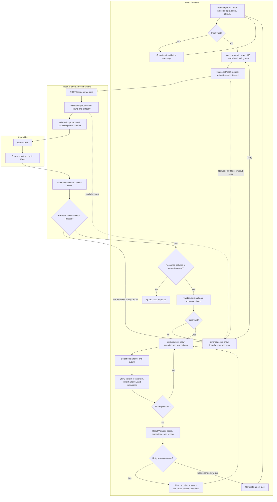

# AI Study Assistant

An AI-powered study tool that turns a topic or notes into an interactive multiple-choice quiz. It is designed as a focused quiz experience, not a chatbot: the backend requests structured JSON from Gemini, validates it, and the React frontend renders the questions and feedback.

- **Live app:** [ai-study-assistent-ruby.vercel.app](https://ai-study-assistent-ruby.vercel.app)
- **API health check:** [ai-study-assistent-ltj9.onrender.com/api/health](https://ai-study-assistent-ltj9.onrender.com/api/health)

## Features

- Enter a topic or paste free-form study notes
- Generate 5- or 10-question quizzes at Easy, Medium, or Hard difficulty
- Answer multiple-choice questions with immediate feedback and explanations
- Track your score and review answers at the end
- Retry only missed questions without making another AI request
- Loading, empty, network, timeout, server, and invalid-response states
- Server-side and frontend validation of AI-generated quiz data
- Stale-request protection so older requests cannot replace newer results
- Responsive, keyboard-accessible interface

## Tech stack

- React 18, Vite, JavaScript, and CSS
- Node.js and Express
- Gemini API

## End-to-end application flow

This flowchart shows how a study request travels through the React app, Express API, and Gemini, then how the quiz is answered, scored, and retried.



The browser calls only the Express API. Gemini is called from the backend, so the Gemini API key is never included in the frontend bundle. Retry Wrong Answers reuses the validated question objects and does not call the AI provider again.

The browser calls only the Express API. Gemini is called from the backend, so the Gemini API key is never included in the frontend bundle.

## Quiz response format

A request to POST /api/generate-quiz includes the study input, requested question count, and difficulty:

```json
{
  "input": "Java inheritance",
  "questionCount": 5,
  "difficulty": "Medium"
}
```

The API returns a quiz object in this format:

```json
{
  "title": "Java Inheritance",
  "topic": "Inheritance in Java",
  "difficulty": "Medium",
  "questions": [
    {
      "id": "q1",
      "question": "Which keyword allows a Java class to inherit from another class?",
      "options": ["extends", "implements", "inherits", "super"],
      "correctAnswer": 0,
      "explanation": "A class uses the extends keyword to inherit from another class."
    }
  ]
}
```

A complete quiz contains exactly the requested number of questions. Every question has exactly four options, and correctAnswer is the zero-based index of the correct option.

## Validation and error handling

The backend validates the provider output before returning it. The frontend validates the response again before rendering anything. Validation checks required text fields, allowed difficulty, question count, four non-empty options, answer index, and explanation. Invalid data is rejected as a whole.

The API layer handles network failures, unsuccessful HTTP responses, malformed JSON, empty responses, and a 45-second timeout. The UI shows a friendly error and retry action. Each request receives an ID stored with useRef; only the newest request can update the screen.

## Quiz state and retry

React Hooks manage the current screen, quiz, selected answers, feedback, score, and errors. After the last question, the result view shows the score and a review of each answer. Retry Wrong Answers filters the existing quiz using the recorded answers and starts a quiz with only the missed questions. It does not call Gemini again.

## Project structure

```text
.
├── src/
│   ├── components/
│   │   ├── EmptyState.jsx
│   │   ├── ErrorState.jsx
│   │   ├── Header.jsx
│   │   ├── LoadingState.jsx
│   │   ├── ProgressBar.jsx
│   │   ├── PromptInput.jsx
│   │   ├── QuestionCard.jsx
│   │   ├── QuestionReview.jsx
│   │   ├── QuizView.jsx
│   │   └── ResultView.jsx
│   ├── lib/
│   │   ├── api.js
│   │   └── validateResult.js
│   ├── App.jsx
│   ├── index.css
│   └── main.jsx
├── server/
│   └── server.js
├── .env.example
├── index.html
├── package.json
└── README.md
```

## Run locally

Requirements: Node.js 20.19 or newer and a Gemini API key.

1. Clone the repository and enter its folder:

   ```bash
   git clone https://github.com/kesharwaniayush/ai-study-assistent.git
   cd ai-study-assistent
   ```

2. Install dependencies:

   ```bash
   npm install
   ```

3. Create a local environment file.

   **Windows PowerShell:**

   ```powershell
   Copy-Item .env.example .env
   ```

   **macOS / Linux:**

   ```bash
   cp .env.example .env
   ```

4. Add your Gemini key to .env:

   ```env
   GEMINI_API_KEY=your_gemini_api_key
   GEMINI_MODEL=gemini-3.5-flash-lite
   PORT=3001
   ```

   Keep the real key private. The .env file is ignored by Git.

5. Start the frontend and backend together:

   ```bash
   npm run dev
   ```

   Open the Vite URL printed in the terminal, usually http://localhost:5173. During local development, the frontend calls the API at http://localhost:3001.

## Available commands

| Command              | Purpose                                              |
| -------------------- | ---------------------------------------------------- |
| npm run dev          | Start the Vite frontend and Express backend together |
| npm run dev:client   | Start only the frontend                              |
| npm run dev:server   | Start only the backend                               |
| npm run build        | Build the frontend into dist/                        |
| npm run preview      | Preview the built frontend locally                   |
| npm start            | Start the Express API                                |
| npm test             | Run the validation tests                             |
| npm run format       | Format source and project files                      |
| npm run format:check | Check formatting                                     |

## API endpoints

### GET /api/health

Returns a small health response:

```json
{ "status": "ok" }
```

### POST /api/generate-quiz

Accepts input, questionCount (5 or 10), and difficulty (Easy, Medium, or Hard). Returns the validated quiz JSON described above, or a JSON error with an appropriate HTTP status.

## Deployment

The frontend and backend are deployed separately.

### Backend on Render

- **Service:** [ai-study-assistent-ltj9.onrender.com](https://ai-study-assistent-ltj9.onrender.com)
- **Build command:** npm install
- **Start command:** npm start
- **Environment variables:**
  - GEMINI_API_KEY: your Gemini API key
  - GEMINI_MODEL: optional; defaults to gemini-3.5-flash-lite
  - FRONTEND_ORIGIN: https://ai-study-assistent-ruby.vercel.app
  - Render provides PORT for the web service

### Frontend on Vercel

- **Framework preset:** Vite
- **Root directory:** repository root
- **Environment variable:**
  - VITE_API_BASE_URL: https://ai-study-assistent-ltj9.onrender.com

VITE_API_BASE_URL is a public API address, not a secret. Do not put GEMINI_API_KEY in Vercel or in frontend source files. Vite reads this variable when building, so create a new Vercel deployment after changing it.

The Render free instance may spin down after inactivity, so its first request in a while may take longer.

## Known limitations

- AI-generated content can occasionally fail validation; the user must try again.
- Quiz quality depends on the accuracy and detail of the supplied notes or topic.
- Generation depends on Gemini availability, API key validity, and provider quota.
- Quiz progress is held in React state and is not saved after a page refresh.
- The free Render service may take longer to respond after inactivity.

## Time spent

development time: **5-6 hours**
